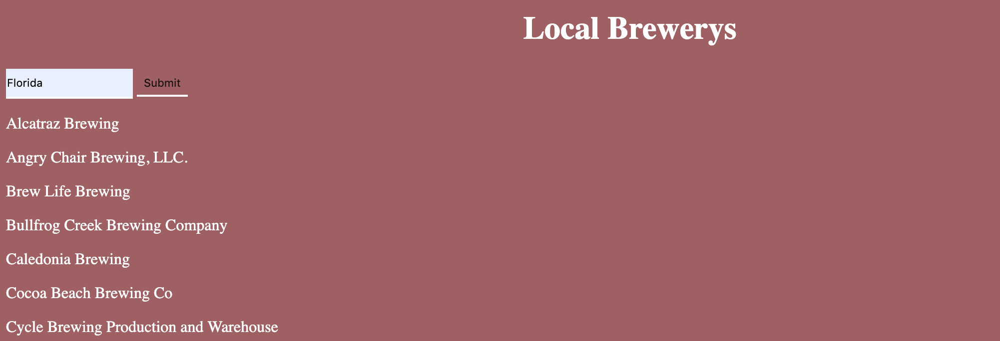

# News Auth Application
In this application the user can search a state and it return brewerys in that state.

## How It's Made:

**Tech used:** HTML, CSS, JavaScript, Node.js, Express Framework of choice

In this application I used a API to grab breweries in different states. You are able to like each.

## Lessons Learned:

I learned how to use someone else's API and then take the information I recieved from that API into my DB

